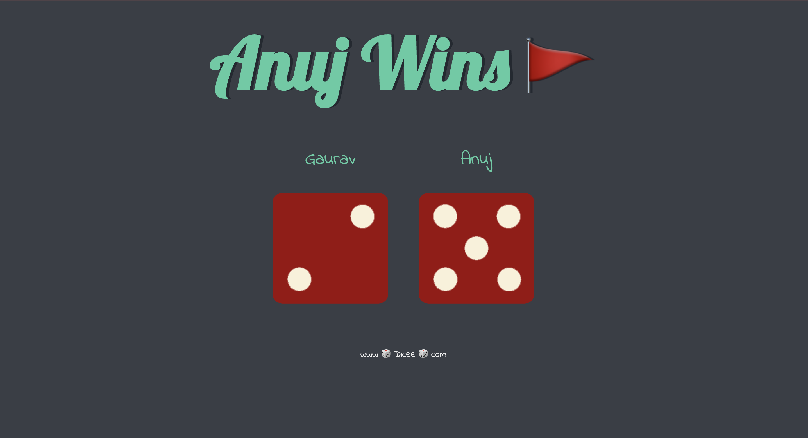

# dev-portfolio
A responsive portfolio website showcasing my skills, projects, and professional experience built with HTML, CSS, and JavaScript.

## 📋 Table of Contents
- [Features](#features)
- [Technologies Used](#technologies-used)
- [Demo](#demo)
- [Installation](#installation)
- [Project Structure](#project-structure)
- [Customization](#customization)
- [Deployment](#deployment)
- [License](#license)
- [Contact](#contact)

## ✨ Features
- Responsive design for all device sizes
- Interactive UI with smooth animations
- Project showcase section
- Contact form
- Education and experience timeline
- Social media integration

## 🛠️ Technologies Used
- HTML5
- CSS3
- JavaScript (Vanilla)
- Media Queries for responsive design

## 🔍 Demo
Check out the live demo: [Demo](https://gaurav-kumar00.github.io/dev-portfolio/)

## 💻 Installation

1. Clone the repository:
```bash
git clone https://github.com/yourusername/portfolio.git
cd portfolio
```

2. No build process or dependencies required - simply open the project in your favorite code editor.

3. To view the website locally, open the `index.html` file in your browser.

## 📁 Project Structure
```
portfolio/
├── index.html              # Main HTML file for the entire website
├── index.js                # JavaScript functionality
├── styles.css              # Main stylesheet
├── mediaqueries.css        # Media queries for responsiveness
├── assets/                 # Images and resources folder
│   ├── about-pic.png       # About section image
│   ├── arrow.png           # Arrow icon
│   ├── checkmark.png       # Checkmark icon
│   ├── Dice-Game.png       # Project screenshot
│   ├── Drum-Kit.png        # Project screenshot
│   ├── education.png       # Education section icon
│   ├── email.png           # Contact icon
│   ├── experience.png      # Experience section icon
│   ├── favicon.ico         # Site favicon
│   ├── Gaurav_Resume.pdf   # Resume PDF
│   ├── github.png          # GitHub icon
│   ├── linkedin.png        # LinkedIn icon
│   ├── profile-pic-2.png   # Alternative profile picture
│   ├── profile-pic.jpg     # Main profile picture
│   └── Simon-Game.png      # Project screenshot
└── README.md
```

## 🎨 Customization

### Personal Information
Edit the `index.html` file to update your name, role, bio, and social media links.

### Projects
Modify the projects section in `index.html` to showcase your own projects. Look for the projects section and update the content:

```html
<div class="project-container">
  <div class="project-card">
    
    <h3>Dice Game</h3>
    <p>Description of your dice game project.</p>
    <div class="project-links">
      <a href="https://github.com/yourusername/dice-game" target="_blank">GitHub</a>
      <a href="https://yourusername.github.io/dice-game" target="_blank">Live Demo</a>
    </div>
  </div>
  <!-- Add more project cards as needed -->
</div>
```

### Styling
Modify the `styles.css` and `mediaqueries.css` files to customize colors, fonts, and layouts. The `mediaqueries.css` file contains responsive design rules for different screen sizes.

## 📤 Deployment

### GitHub Pages
1. Create a GitHub repository for your portfolio (if you haven't already)
2. Push your code to the repository
3. Go to Settings > Pages
4. Select the main branch as source
5. Your site will be published at `https://yourusername.github.io/portfolio`

### Other Hosting Options
You can also deploy your portfolio on:
- Netlify (drag and drop the folder)
- Vercel
- Any web hosting service that supports static websites

## 📄 License
This project is licensed under the MIT License - see the [LICENSE](LICENSE) file for details.

## 📬 Contact
- [Gmail](mailto:gk94129@gmail.com)
- [LinkedIn](https://www.linkedin.com/in/gaurav-kumar-9b5689250/)
- [GitHub](https://github.com/Gaurav-Kumar00)

---

⭐️ From Gaurav-Kumar00
